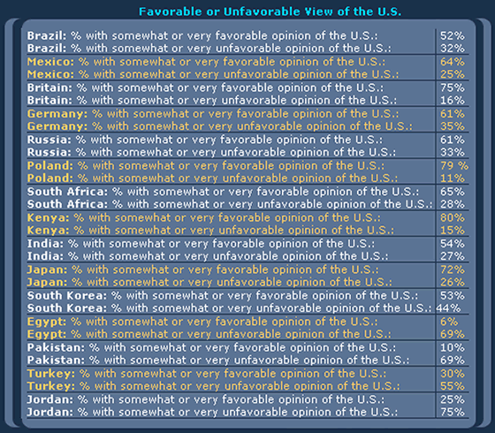

```{r eval=FALSE, include=FALSE}
stringr::str_c("[",x,"]","(#",stringr::str_replace_all(x, " ", "-") %>% stringr::str_to_lower(),")")
```


1. [Introudction](#introduction)
1. [Understand the Power of Data Viz](#understand-the-power-of-data-viz)
1. [Start With the Big Picture](#start-with-the-big-picture)
1. [Design With Your Audience in Mind](#design-with-your-audience-in-mind)
1. [Focus On Details](#focus-on-details)
1. [Find Mentors](#find-mentors)
1. [Practice](#practice)

## Introduction

Whether you are just starting out on your data science journey or been in the game for a while, there is never a shortage of things to learn or skills to pickup. One must-have skill all data scientist need in their toolkit is the ability to create clear, concise, and meaningful Data Visualizations. 

Even if you are the best ML engineer of all-time, your models will sit in your github repo if you cannot communicate the value to leaders. Leaders are busy and most make many decisions across different domains. They want -- and deserve -- their information presented in a clear and concise manner. If you make them spend their cognitive energy and time deciphering your chart, they may not have time to think about the next steps or, worse, may come away with the wrong conclusion.

## Understand the Power of Data Viz

The power behind data visualization is directly linked to the way our brains process information. Our brains are not capable of holding large volumes of data in memory - most people struggle to keep more than seven items in their working memory at a time - but are excellent at recognizing patterns. Data visualization takes advantage of these two facts by removing the requirement to hold a large number of data points in memory, which frees up our cognitive energy to focus on discovering patterns and relationships.

Consider Anscombe’s quartet:

```{r include=FALSE}
library(tidyverse)
df_a <- readr::read_csv("a_data.csv")

```


<table class="wikitable" style="text-align: center; margin-left:auto; margin-right:auto;" border="1">
<caption>Anscombe's quartet
</caption>
<tbody><tr>
<th colspan="2">I
</th>
<th colspan="2">II
</th>
<th colspan="2">III
</th>
<th colspan="2">IV
</th></tr>
<tr>
<td>x
</td>
<td>y
</td>
<td>x
</td>
<td>y
</td>
<td>x
</td>
<td>y
</td>
<td>x
</td>
<td>y
</td></tr>
<tr>
<td>10.0</td>
<td>8.04</td>
<td>10.0</td>
<td>9.14</td>
<td>10.0</td>
<td>7.46</td>
<td>8.0</td>
<td>6.58
</td></tr>
<tr>
<td>8.0</td>
<td>6.95</td>
<td>8.0</td>
<td>8.14</td>
<td>8.0</td>
<td>6.77</td>
<td>8.0</td>
<td>5.76
</td></tr>
<tr>
<td>13.0</td>
<td>7.58</td>
<td>13.0</td>
<td>8.74</td>
<td>13.0</td>
<td>12.74</td>
<td>8.0</td>
<td>7.71
</td></tr>
<tr>
<td>9.0</td>
<td>8.81</td>
<td>9.0</td>
<td>8.77</td>
<td>9.0</td>
<td>7.11</td>
<td>8.0</td>
<td>8.84
</td></tr>
<tr>
<td>11.0</td>
<td>8.33</td>
<td>11.0</td>
<td>9.26</td>
<td>11.0</td>
<td>7.81</td>
<td>8.0</td>
<td>8.47
</td></tr>
<tr>
<td>14.0</td>
<td>9.96</td>
<td>14.0</td>
<td>8.10</td>
<td>14.0</td>
<td>8.84</td>
<td>8.0</td>
<td>7.04
</td></tr>
<tr>
<td>6.0</td>
<td>7.24</td>
<td>6.0</td>
<td>6.13</td>
<td>6.0</td>
<td>6.08</td>
<td>8.0</td>
<td>5.25
</td></tr>
<tr>
<td>4.0</td>
<td>4.26</td>
<td>4.0</td>
<td>3.10</td>
<td>4.0</td>
<td>5.39</td>
<td>19.0</td>
<td>12.50
</td></tr>
<tr>
<td>12.0</td>
<td>10.84</td>
<td>12.0</td>
<td>9.13</td>
<td>12.0</td>
<td>8.15</td>
<td>8.0</td>
<td>5.56
</td></tr>
<tr>
<td>7.0</td>
<td>4.82</td>
<td>7.0</td>
<td>7.26</td>
<td>7.0</td>
<td>6.42</td>
<td>8.0</td>
<td>7.91
</td></tr>
<tr>
<td>5.0</td>
<td>5.68</td>
<td>5.0</td>
<td>4.74</td>
<td>5.0</td>
<td>5.73</td>
<td>8.0</td>
<td>6.89
</td></tr></tbody></table>

Each of these four data sets has the same mean and standard deviation.

```{r, echo = FALSE}


df_a %>% 
  group_by(data) %>% 
  summarize(`Mean of x` = mean(x),
            `Mean of y` = mean(y),
            `SD of x` = sd(x),
            `SD of y` = sd(y)) %>% 
  mutate_all(round, digits = 2) %>% 
  tidyr::pivot_longer(cols = -c(data)) %>% 
  rename(Statistic = name) %>% 
  mutate(data = stringr::str_c("Data Set " , data)) %>% 
  spread(key = data, value = value) %>% 
  knitr::kable()

```

However, when we plot these data sets, we see a totally different story.

```{r, echo = FALSE}
df_a %>% 
  mutate(data = stringr::str_c("Data Set ", data)) %>% 
  ggplot(aes(x = x, y = y)) +
  geom_point(size =3,
             color = "royal blue") +
  facet_wrap(~data) +
  geom_smooth(method = "lm", 
              se = FALSE,
              fullrange=TRUE,
              # linetype = "dashed",
              color = "#8c8c8c") +
  theme_classic() +
  scale_y_continuous(breaks = seq(0,14, by = 2)) +
  scale_x_continuous(breaks = seq(0,20, by = 2))
```

Without any statistical training, the average person can explain how these data sets are different. 

Consider this [example](http://www.perceptualedge.com/example8.php) from Stephen Few:

Can you determine which country has the lowest unfavorable rating? What about the highest?

```{r, echo = FALSE}

```

How about now?

```{r, echo = FALSE}

```

Using color, ordering, spatial representation, create a much clearer picture.  If you hand the first one to a leader, they might throw it at you. On the other hand, the second chart leads to thoughtful discussion and a clear picture of who does and does not like the US. Instead of trying to decipher the story, the leader can now move on to new questions: what is causing the data that we are seeing.

## Start With the Big Picture

You should always begin the data science process by defining your problem. What question are you trying to answer? What decision are we trying to inform? Creating a data visualization is no exception. Before we start generating plots, we need to think about the key points we are trying to communicate. Focus on the key points first! You never want to waste effort creating sophisticated visualizations that do not tie back to your original objective.

As an example, remember the old Snickers commercial where the guy writes CHEFS instead of CHEIFS in the end-zone?!? He painstakingly colors each blade of grass and uses superior technical skill but loses sight of the big picture. He is now stuck with hours of work to undue the mess; don't be this guy! 
<center>
[Hey that's great, but who are the chefs?](https://www.youtube.com/watch?v=2jVdxDUYN7w)
</center>

## Design With Your Audience in Mind

The type of visualization you create is dependent on the audience. You should create the graphic with minimal expectations on the users.  Below are some important considerations about your audience:

1.  What is their familiarity with the subject?
2.  What is their technical background?
2.  How much time will they have to consume your product?
3.  Is the visualization going in a report, presentation, website, etc.?
4.  What do you want your audience to know or do?

The last one is extremely important. We conduct analysis to inform decisions so think about the decision your audience needs to make.

## Focus On Details

While crafting a visualization, you should constantly question every element on the chart with one question in mind: if I remove this item, do I lose valuable information or context? Every detail should add clarity and context for the audience. Distractions increase the likelihood your message will be lost.  

Best Practices:

 * Accurately convey the data
 * Clearly label your plot
 * Remove clutter
 * Make order matter
 * Highlight the important parts
 * Tell your story


In my days as an analyst and even as a consultant, I would often have people pile on my charts and try to add a bunch of clutter.  Other analysts, mid-level managers, or staff members would critique my charts as too simple and show me options to make 3-D bar charts with black backgrounds and cover every inch of the chart with wording and numbers - often resembling a used car ad by the time they were done. But, when it came time to brief leadership on a topic, I always had better success when I kept it simple and was relentless with removing distractions. 

Defend you work and your story from those that want to jazz-up your chart and make it sexier! Just because your favorite Data Visualization tool has the option, does not mean you should use it - a 3-D exploding pie chart may be the worst data visualization of all-time but excel will still offer it to you.
 
Keep it simple and your story will come through.


## Find Mentors

If you ask a successful writer how they perfected their craft, many will tell you by reading, a lot! Storytelling with data is no different. In order to create meaningful visualizations you need to see what others have done. Finding mentors is key! 

Do not worry if you cannot find one where you work or are currently going to school. To be honest, most of the people I worked with or for were pretty bad at data visualization. Even if you have someone that is decent, chances are they are not one of the best of in the world. With the internet, you have access to thoughtful approaches and practices that have timeless fundamentals. My approach is to read a couple books that get to the fundamentals and follow creators on social media to explore the realm of possible. Below are a few of my favorites.

* [Nadieh Bremer](https://www.visualcinnamon.com/)
* [Nathan Yau](https://flowingdata.com/)
* [Edward Tufte](https://www.edwardtufte.com/tufte/)
* [Stephen Few](http://www.perceptualedge.com/)

## Practice

Finally, as I like to tell my kids, in order to make good barbecue, you have to have experience, and the only way to get experience is by making bad barbecue. Likewise for storytelling with data. You will not make that New York Times front page visualization until you make a lot of really bad charts. So, what are you waiting for? Get out there and make some bad barbecue.


