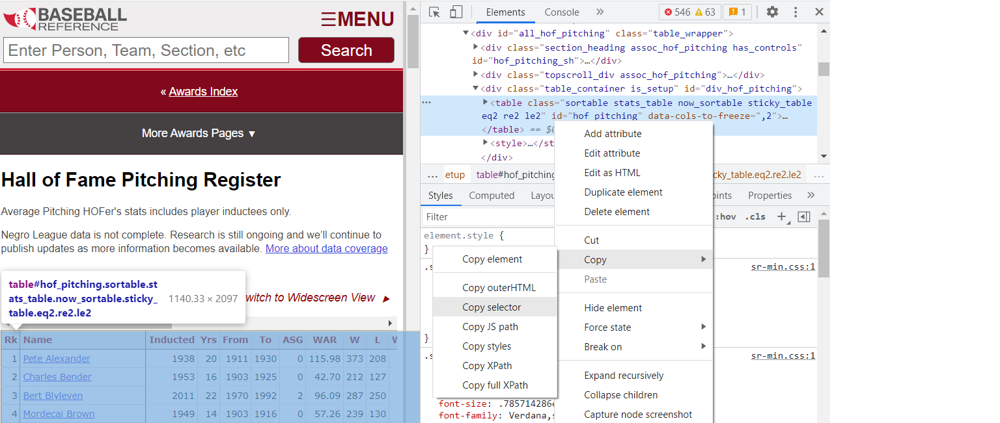

1. [Web Scraping Basics](#web-scraping-basics)
1. [Elements](#elements)
1. [Simple Example](#simple-example)
1. [CSS Selectors](#css-selectors)
1. [Real World Example](#real-world-example)


Web Scraping is important tool every Data Scientist should be familiar with. Often the data a client wants to analyze is not neatly packed in jsons or an enterprise data base, and you need to collect it yourself. When the data you need is on a webpage and there is no API available, web scraping will be the tool you need.

Today we will walk through a simple example where we need to collect a table from a web page. Our goal will be to collect all the hall of fame pitchers from [Baseball Reference](https://www.baseball-reference.com/).

## Web Scraping Basics

Web Scarping is the process of parsing HTML `elements`, which consist of `tags` that delineate the start and end of an `element` and optional `attributes` that describe the element.  

## Elements

Below are some of the most common elements.

* `<html>`...`</html>` — The root element
* `<head>`...`</head>` — The document head
* `<title>`...`</title>` — The page title 
* `<body>`...`</body>` — The page's content
* `<h1>`...`</h1>` — A section heading.
* `<p>`...`</p>` — A paragraph.
* `<a>`...`</a>` — A link.
* `` — An image.

Check out this [site](https://www.elated.com/first-10-html-tags/) for more info.

Here is a basic page:

```{r, eval = FALSE}
<html>
<head>
  <title>My Website</title>
</head>
<body>
  <h1>Heading 1</h1>
  <p>This is a paragraph</p>
</body>
</html>
```


## Simple Example

To conduct our first web scraping task, we will use the `read_html()` function to convert our raw html into an html document object we can parse. Next, we will use the `html_node()` function to select the `h1` element. Finally, we will use `html_text()` to extract the content in between the `h1` tags.

```{r message=FALSE, warning=FALSE}
library(rvest)
library(dplyr)
library(readr)
```

```{r}
raw_html <- '<html>
<head>
  <title>My Website</title>
</head>
<body>
  <h1>Heading 1</h1>
  <p>This is a paragraph</p>
</body>
</html>'

html <- read_html(raw_html)
html
```


```{r}
html %>% 
    html_nodes("h1") %>%  # grab the h1 elements
    html_text()           # extract the content
```

## CSS Selectors

While selecting by elements is pretty straight forward, elements are often repeated multiple times on a single page. To make our request more specific, we can use CSS selectors.

CSS is used to style of the content of html documents, and CSS selectors are used to match CSS rules to elements in the html. We can use CSS selectors to traverse complicated HTML structure and extract the exact data we need. Below are the most common selectors I have used.


* `Element` Selector 
* `Class` Selector
* `ID` Selector

Let's walk through a simple example.

```{r}
raw_html <- "<html>
    <head>
      <title>My Website</title>
    </head>
    <body>
      <h1 id = 'header1'>Heading 1</h1>
      <p>This is a paragraph</p>
      <h1 class = 'header'>Heading 2</h1>
      <p>This is a paragraph</p>
      <h1 class = 'header'>Heading 3</h1>
        <p>This is a paragraph</p>
    </body>
</html>"

html <- read_html(raw_html)
html
```

Below is how we can select by `element`, `class`, or `id`.

* `Element` Selector: use `h1` to select all `<h1>` elements
* `Class` Selector: use `.header` to select all elements with `class` `header`
* `ID` Selector: use `#header1` to select the element with `id` attribute `header1`

Now, let's write the code to complete each of these tasks.

To get all the heading content, we use the `h1` selector.

```{r}
html %>% 
    html_nodes("h1") %>% 
    html_text()
```

To get the second and third headings, we can use the `.header` selector since both elements belong to the `header` `class`.

```{r}
html %>% 
    html_nodes(".header") %>% 
    html_text()
```

Finally, we can use the`#header` selector to get the content from the first heading. Note, `id` is unique for a particular element and cannot be repeated. Because of this fact, if an element has an `id`, it is often the easiest selector to use.

```{r}
html %>% 
    html_nodes("#header1") %>% 
    html_text()
```
If you want more practice with CSS selectors, check out this [page](https://flukeout.github.io/).

## Real World Example

Now that we have reviewed the basics. Let's try a real world example: scraping the hall-of-fame pitchers from [https://www.baseball-reference.com/awards/hof_pitching.shtml]("https://www.baseball-reference.com/awards/hof_pitching.shtml).


## Finding the CSS Selector

Luckily, most browsers offer support to find the selector you need without having to parse the entire html document. To get started, right-click on a page and select the inspect option.  Next, as you can see in the screenshot below, click the the select tool and hover over the the part of the webpage that has your data. Once your data is in the blue box, left-click and the html element will appear on the right side. It will also show the CSS selector for that particular element in the box above your selection. 

{width=100%}

You can even right click on the element in the window in the top right corner and copy the selector. 

{width=100%}

## Extract the Data

Now that we have the selector, we can grab the data we need. Let's start by reading the html.

```{r}
url <- "https://www.baseball-reference.com/awards/hof_pitching.shtml"
html <- read_html(url)
html
```

Now we can grab the table using the `#hof_pitching` selector and will convert the table to a data frame using the `html_table()` function.

```{r}
df_raw_pitchers <- html %>%
        html_node("#hof_pitching") %>% 
        html_table()

glimpse(df_raw_pitchers )
```

There you have it, the data we wanted in a data frame.

## Data Cleaning

While the process above seemed very simple, web scraping is usually not this easy.

One task you will often have to complete with web scrapping is cleaning your data after extraction. In this example, the last row has the value "Average Pitching HOFer", which would throw off our analysis if we did not know it was there. Always be sure to inspect the returned results for anomalies.


```{r}
df_final <- df_raw_pitchers %>% 
    filter(!stringr::str_detect(Name, "Average"))
glimpse(df_final)

```

## Extracting Additional Info

We may also want more than just the text content of the table. For example, the player names on the website are links to that players page. We may want those links so we can scrape those pages for additional data.

If we inspect the players name, we find the html element below:

```{r, eval = FALSE}
<a href="/players/a/alexape01.shtml">Pete Alexander</a>
```

An `a` tag is used for links and will have a `href` attribute for the link.
Instead of grabbing the text, we now want to grab the `href` attribute from the `a` element.

To get all the player links, we first grab the `a` elements from he table. Next, we use the `html_attr()` function to get the `href` attribute.  Finally, to use this link, we need to add the baseball reference URL to the front of the link.

```{r}
player_links <- html %>%
    html_node("#hof_pitching") %>% 
    html_nodes("a") %>% 
    html_attr("href") %>% 
    stringr::str_c("https://www.baseball-reference.com", .)

player_links[1]

```

Now that we have the link to every players page, we can use the same process from above to get the year-by-year pitching data from each payers page, assuming that all the pages have the same structure.

Below is an example of collecting the year-by-year pitching data for the first HOFer on our list.

```{r}
player_df <- player_links[1] %>% 
    read_html() %>% 
    html_node('#pitching_standard') %>% 
    html_table()

glimpse(player_df)
```


Since we will want this data for all players, we need to reuse this code. Anytime you plan to reuse code, you should create a function. This will save copy and paste errors and allow you to modify it in the future without having to find every place in your code that you copy and pasted your initial process.

Let's make a function that takes a players URL as input and outputs their year-by-year stats as a data frame.


```{r}
get_player_stats <- function(url){
    
    data <- url %>% 
        read_html() %>% 
        html_node('#pitching_standard') 
    
    #handles if the page does not have this table
    if(length(data) == 0){
        return(tibble::tibble())
    }
    
    data %>% 
        html_table(fill = TRUE)
}

player_data <- purrr::map(player_links, get_player_stats)
glimpse(player_data[[1]])
```

One note with web scraping: error handling is a must when collecting data from numerous pages. You often run into unexpected formatting or a slight change in the page structure that will break your process.  If you are scraping 100s of pages, you would hate to complete 95% of your collection only to have an unhandled error cause the process to stop, all collected data to be lost, fix the error, and rerun the whole process again. 

For example, if you inspect the returned results from the player pages above, you will notice two players did not return results.  

```{r}
rows <- purrr::map_dbl(player_data, function(x) dim(x)[1])
player_links[rows == 0]
```

Both of these players were not primarily pitchers and have a different structure to their page. If we had not added if statement that checks if the webpage has our selector, the collection process would have broke and all data would have to be recollected. 

This is part of the pain with web scraping and an important fact to keep in mind when estimating the feasibility of a task and the time it will take to complete it. What appears to be a simple task can turn into a long reverse engineering project.

## Conclusion

Hopefully you have a basic understanding of web scraping. To close out, let's review the keys to successful web scraping:

1. Understand HTML elements and CSS selectors
2. Inspect your returned data
3. Write functions for reuse
4. Include error handling to prevent data and time loss
5. Conduct thorough research and tests before estimating the difficulty of a project


