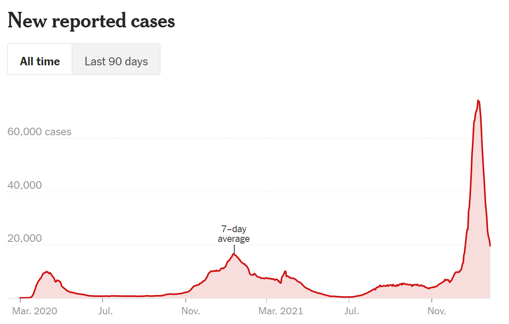

In a previous [article](https://medium.com/@nickryanpaul/6-data-visualization-fundamentals-every-data-scientist-needs-to-know-d6cca4a33985), I mentioned the need to find mentors to enhance your ability to create clear, concise, and meaningful data visualizations. The New York Times is one example I highly recommend you follow. They do an excellent job of creating information rich charts that are understandable to a wide variety of people.  One example is their COVID 19 tacker.



You may be thinking, sure, that chart looks great, but I have no idea how to create something like this. Well, you are in luck. I am going recreate their COVID tracker using `R` and `ggplot2`. Since I am using `ggplot2`, it will not be interactive like their chart, but, the interaction feature on this particular chart does not add much value and depending on the resources available to you, it is often easier to distribute static charts to your consumers, especially if your work is required to go into a PowerPoint.

```{r setup, include=FALSE}
knitr::opts_chunk$set(echo = TRUE, message = FALSE, warning = FALSE)
```

We will start by loading the libraries needed for this project.

```{r}
library(dplyr)
library(readr)
library(ggplot2)
```

## Import Data

Next, we need to grab the data. Luckily, the NYT posts their COVID data on github.

```{r}
url <- "https://raw.githubusercontent.com/nytimes/covid-19-data/master/us-states.csv"
df_states <- readr::read_csv(url)
glimpse(df_states)
```

## Transform the Data

This data set has the cumulative cases and deaths on a given day for each state. To simplify the process, we will start with one state: New York.


```{r, eval=FALSE, include=FALSE}
url <- "https://raw.githubusercontent.com/nytimes/covid-19-data/master/us-states.csv"
download.file(url, "/home/rstudio/projects/website-clean-white/content/post/2022-01-27-nyt-plots/us-states.csv", method = "curl")
df_states <- readr::read_csv("./us-states.csv")
df_states
```

```{r}
df_ny_raw <- df_states %>% 
    filter(state == "New York") 

glimpse(df_ny_raw)
```

As you can see below, the `cases` column has the cumulative cases up to that date.  

```{r}
df_ny_raw %>% 
    ggplot(aes(x = date, y = cases)) +
    geom_line()
```

In order to get the case count for each day, we need to take the difference between the current date and the previous date. We can do this using the `lag()` function from `dplyr`.

```{r}
df_ny = df_ny_raw %>% 
    mutate(cases = cases - lag(cases,
                               default = 0))

df_ny %>% 
    ggplot(aes(x = date, y = cases)) +
    geom_line()
```

We now have cases-per-day, but our line is not as smooth as the NYT chart above. The NYT uses a smoothed 7-day average in order to minimize the day-to-day variability and highlight the longer-term trends.


To create the 7-day average, we will sum the case counts from the current day and the previous 6 days and divide by 7. 

```{r}
df_ny_smooth = df_ny %>% 
    mutate(smooth = sum(cases, 
                        lag(cases, 1), lag(cases, 2), 
                        lag(cases, 3), lag(cases, 4),
                        lag(cases, 5), lag(cases, 6))
                    /7)
```

If we want to save some typing and make it easy to repeat this process, we could write a custom function to complete the same goal.

```{r}

rolling_average <- function(x, period = 7){
    
    total = x
    
    for(i in 1:period-1){
        total = total + lag(x,i)
    }
    
    return(total/period)
    
}

df_ny_smooth = df_ny %>% 
    mutate(smooth = rolling_average(cases))

df_ny_smooth
```

Now that the data is ready, we will build the chart in layers.


## Basic Chart

```{r}
plot_nyt <- df_ny_smooth %>% 
    filter(!is.na(smooth)) %>% 
    ggplot(aes(x = date, y = smooth)) +
    geom_line(color = "red") + 
    geom_area(fill = "red", alpha = .25)

plot_nyt
```

## Update the Theme

```{r}
plot_nyt <- plot_nyt +
theme(
          panel.background = element_blank(),    
          axis.text.y = element_text(angle = 0, vjust = -.5, 
                                     margin = margin(r = -30)),
          panel.grid.minor = element_blank(),
          panel.grid.major.x = element_blank(),
          panel.grid.major.y = element_line(colour = 'light grey', 
                                          linetype = 'dashed',size = .35),
          axis.ticks.x = element_line(color = "light grey"),
          axis.ticks.y = element_blank(),
          axis.line.x = element_line(colour = "light grey", linetype = "solid",
                                     size = .5))
plot_nyt
```

## Adjust the Scales

```{r}

breaks <- scales::extended_breaks()(df_ny_smooth$smooth)
breaks <- breaks[2:length(breaks)]

plot_nyt <- plot_nyt +
    scale_x_date(expand = c(0,0),
                 date_labels = "%b-%Y") +
    scale_y_continuous(expand = c(0,0),
                       breaks = breaks,
                       limits = c(0,max(df_ny_smooth$smooth))) +
    labs(y = NULL,
         x = NULL,
         title = "New Reported Cases: New York")
plot_nyt
    
```

## Add Annotations

Annotations really take your chart to the next level. They are a great way to add context to your chart and tell a story.  For this example, we will add text and a line segment to describe what data represents. Annotating the smoothed line directly, as opposed to adding a legend, is a great way to save space on your chart. Also, the user does not have to hunt for the information because it is dead center in the chart!

If you look closely, you will notice the NYT uses logic to put their annotation toward the middle of the chart but always on the apex of curve (look at different examples of the states to see this in action). This is a nice touch that really gives their charts that extra wow factor. 

Below is a way to recreate their process. We simply take a slice from the center of the chart (120 day period) and find the maximum point on the smooth line. We will then add our annotations off this reference point.

```{r}
max_date = df_ny$date %>% median() + 60
min_date = df_ny$date %>% median() - 60

label_vals = df_ny_smooth %>% 
    filter(date > min_date, date < max_date) %>% 
    arrange(desc(smooth)) %>% 
    top_n(1)

label_vals 
```

Now that we have our reference point, let's add the annotations.

```{r}
plot_nyt +
    annotate("text", x = label_vals$date, 
             y = label_vals$smooth * 1.4, 
             label = "7-day\naverage",
             size = 3.5,
             fontface = "plain") +
    annotate("segment", x = label_vals$date, xend = label_vals$date,
             y = label_vals$smooth, 
             yend = label_vals$smooth * 1.2,
             size = .25) 
```


There you have it, a quality chart worthy of publication in the New York Times. This example should be easy to adapt to any similar time-series data you might have. Good luck!

```{r eval=FALSE, include=FALSE}
df_ny %>% 
    filter(date >= lubridate::ymd("20210110"),
           date <= lubridate::ymd("20210117"))
```


```{r eval=FALSE, include=FALSE}
df_ny %>% 
    ggplot(aes(x = date, y = cases)) +
    geom_line(aes(y = smooth), color = "red") +
    geom_area(aes(y = smooth), fill = "red", alpha = .25) +
    annotate("text", x = label_vals$date, 
             y = label_vals$smooth * 1.4, 
             label = "7-day\naverage",
             size = 3.5,
             fontface = "plain") +
    annotate("segment", x = label_vals$date, xend = label_vals$date,
             y = label_vals$smooth, 
             yend = label_vals$smooth * 1.2,
             size = .25) +
    scale_x_date(expand = c(0,0),
                 date_labels = "%b-%Y") +
    scale_y_continuous(expand = c(0,0),
                       breaks = c(20000,40000,60000)) +
    theme_minimal() + 
     theme(
         # axis.text.y = element_text(margin = margin(r = -4)),
          axis.text.y = element_text(angle = 0, vjust = -.5, margin = margin(r = -30)),
          # axis.text.y = element_blank(),
          panel.grid.minor = element_blank(),
          panel.grid.major.x = element_blank(),
          panel.grid.major = element_line(colour = 'light grey', linetype = 'dashed',size = .35),
          axis.ticks.x = element_line(color = "light grey")) +
    labs(y = NULL)
    # geom_smooth() +
    # geom_line()
```

