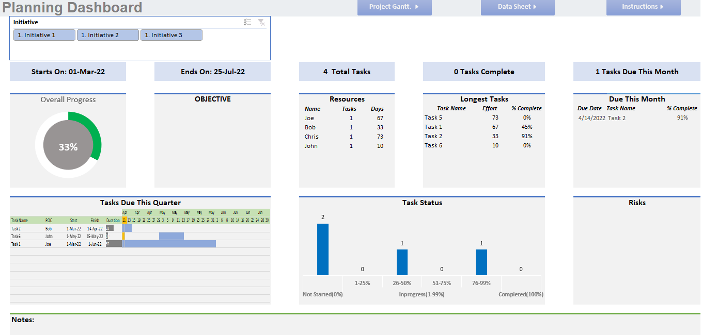
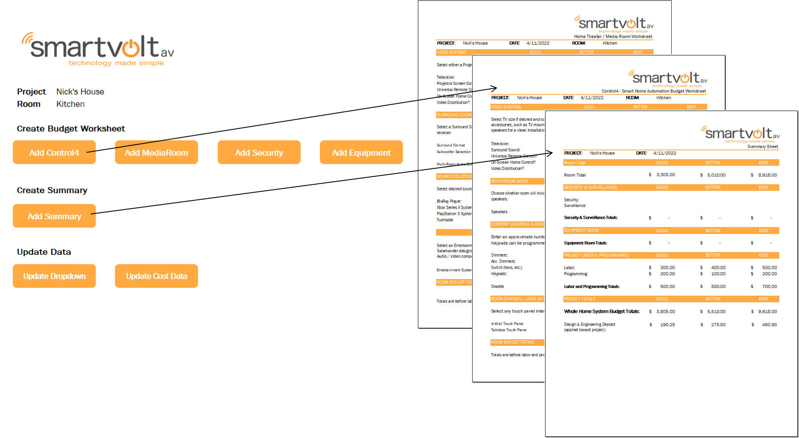
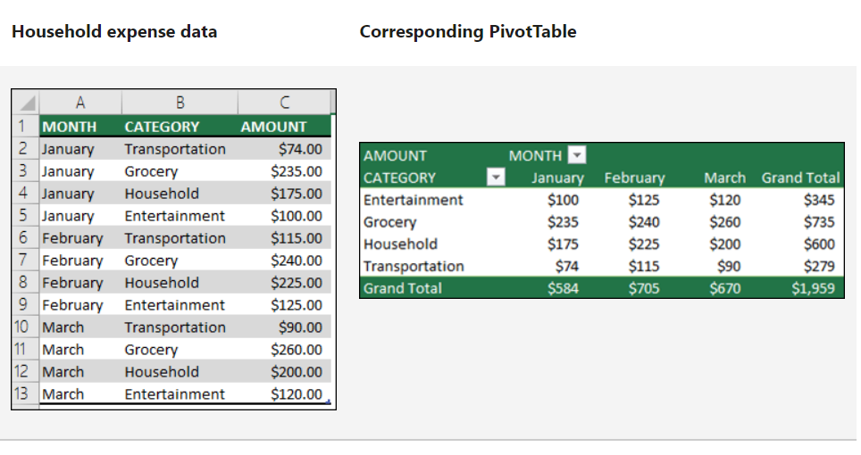

1. [Dasboards](#dashboards)
1. [Automation](#automation)
1. [Core Features](#core-features-that-drive-useful-excel-tools)
1. [Next Steps](#next-steps)

Excel is a popular, easy-to-use, and powerful tool. Most importantly, most people already have Excel, so the cost of an Excel tool is extremely low! If you are a small business or have limited resources to commit to a data solution, an Excel based tool is a great option to consider. As one of my professors in grad school used to say: "we went to the moon using a slide rule, so Excel can solve most problems that exist on earth!" 

In this post, we will review a few solutions I have used Excel to develop and the core functions that drive these tools.

# Dashboards

An excel dashboard is great option for teams with limited budgets. If you need simple summary statistics, Excel can give you a great looking dashboard that you can slice and dice to answer your questions. Some of the benefits of Excel Dashboard include:

* Easy data entry (most people have excel experience)
* Click button updates
* No hosting or licensing costs
* Easy to format
* Filter data using buttons
* Leverage all the powerful features available in excel PivotTables

The example below highlights a planning dashbaord that supports managing tasks and resources.

# Automation

If you need to create standard reports from your data, Excel and its programming language, VBA, should be able to solve many of your automation problems.

In the example below, a user can generate standardized, professional reports, which have built-in formulas to lookup values and calculate totals. A user can also generate summary reports that aggregate results from generated reports.

# Core Features that Drive Useful Excel Tools

## PivotTables

My favorite tool in in Excel is PivotTables. If your data is structured correctly, you can slice and dice your data to quickly summarize large amount of data without writing any code. Below are a few of the key features:

1) Count, Sum, or Average data.
2) Aggregate data by categories and subcategories.
3) Create custom calculations and formulas.
2) Quickly filter data to analyze different segments.
3) Sort data by value or custom ordering.
3) Double click to see underlying data and review details.

Below is a simple [PivotTable example](https://support.microsoft.com/en-us/office/overview-of-pivottables-and-pivotcharts-527c8fa3-02c0-445a-a2db-7794676bce96) from Microsoft.

Once you create a PivotTable to calculate the metrics you are interested in, it is easy to incorporate the results into dashboards and link to charts.

## Formulas

Excel has many powerful built in formulas that allow you to lookup values, compute future values of investments, conduct statistical tests, and determine the number of working days between two dates, just to name a few.

1) **vlookup (the formula I use most often)** - append data from one table to another using an index
2) if - return a value based on conditions
2) networkdays - compute the number of work days between two date, with an option to exclude custom holidays
3) FV - determine the future value of a current principal, future payments, with a given interest rate over specified intervals

These are few I use most often, but this is just a small introduction to the built-in power of Excel.

## VBA

VBA is a useful tool when you need to automate repetitive tasks in excel. It is also useful when the logic required to return a value is very complicated or your workbook is very slow due to an abundance of formulas living in your worksheet. In these situations, VBA is great option to pursue. 

Below are some common problems I use VBA to solve:

1) Update data with a click of a button without the user having to follow a long list of steps. 
2) Create reports from templates and update values from reference data.
3) Compute values based on a complex logic.

When a formula or PivotTable cannot solve your problem, chances are we can use VBA to produce the solution we need.

# Next Steps

The best way to see the power of an Excel-Tool is to see one in use. What are you waiting for, let's get started today.

